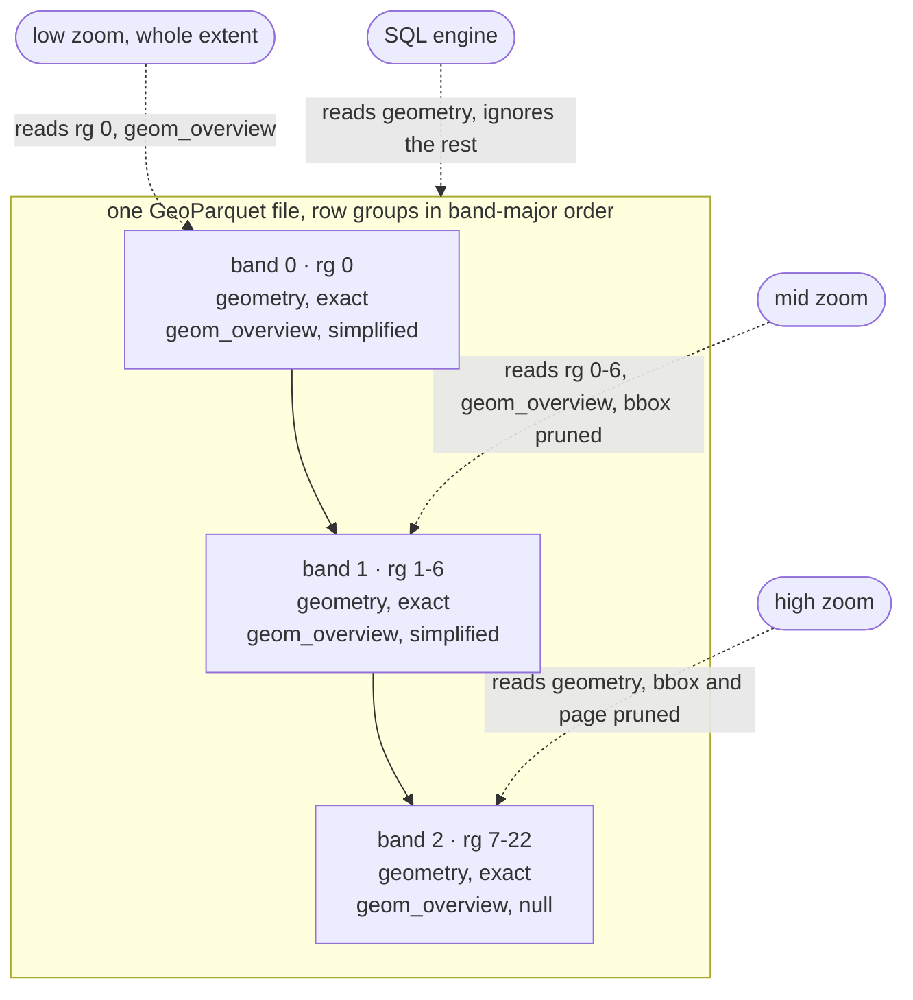

# geoparquet-overviews

One GeoParquet file that a web map can preview instantly and a SQL engine can
read in full, with no duplicated exact geometry. Measured on 5.65 million
building polygons, a whole-country first paint reads about 9 MB instead of the
620 MB exact geometry column, roughly 67x less, from one file that DuckDB
still reads unchanged. Think COG overviews, for vectors.

## The idea

Three additions a plain reader safely ignores.

- **Importance order.** Rank features by how much they matter at low zoom,
  split them into a few bands, Hilbert-sort within each band. Every feature is
  stored once, and the coarse bands land in a contiguous row-group prefix.
- **An overview column.** Coarse bands carry a simplified, grid-snapped copy
  of their shape in a second geometry column named `geom_overview`. The finest
  band leaves it null. The primary `geometry` column is never touched.
- **A footer note.** An `overviews` key next to the standard `geo` key records
  which row-group prefix belongs to which band and which zooms each band
  serves. Unknown keys are ignored, so every existing reader sees a valid
  GeoParquet file and reads every row at exact precision.



## Links

- **Live viewer**, https://yharby.github.io/geoparquet-overviews/
- Status, draft 0.2.0. License, Apache-2.0. See [LICENSE](LICENSE).

## Quickstart

```bash
# convert a file, no clone or install needed
uvx --from "git+https://github.com/yharby/geoparquet-overviews#subdirectory=converter" \
  gpo convert in.parquet out.parquet
```

Host the output anywhere that serves range requests and paste its URL into
the [live viewer](https://yharby.github.io/geoparquet-overviews/), or run the
viewer locally.

```bash
git clone https://github.com/yharby/geoparquet-overviews
cd geoparquet-overviews/viewer && pnpm install && pnpm dev
```

## How a client reads it

- **First paint.** The footer, then the `geom_overview` chunks of the band 0
  prefix. A few MB in a few range requests.
- **Zoomed in.** The band for the current zoom, its row groups pruned by bbox.
- **High zoom.** When a row group covers far more area than the view, only the
  pages of it that overlap, using the bbox covering column's page index.
- **SQL engine.** The exact `geometry` column with predicate pushdown,
  ignoring `overviews` entirely.

## Docs

- [SPEC.md](SPEC.md), the normative convention.
- [DESIGN.md](DESIGN.md), the full rationale, footer walkthrough, measured
  results, and ecosystem positioning.
- [converter/README.md](converter/README.md), the reference converter, Python.
- [viewer/README.md](viewer/README.md), the reference viewer, TypeScript.
