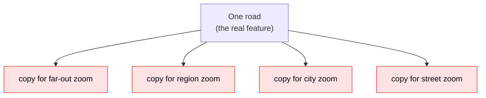
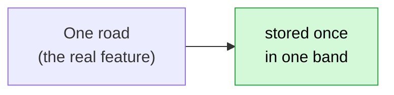
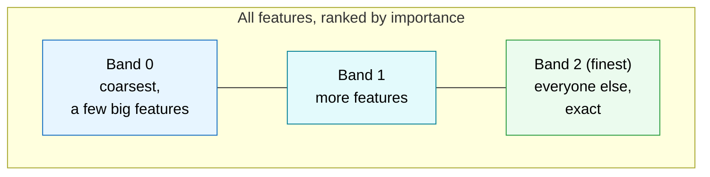
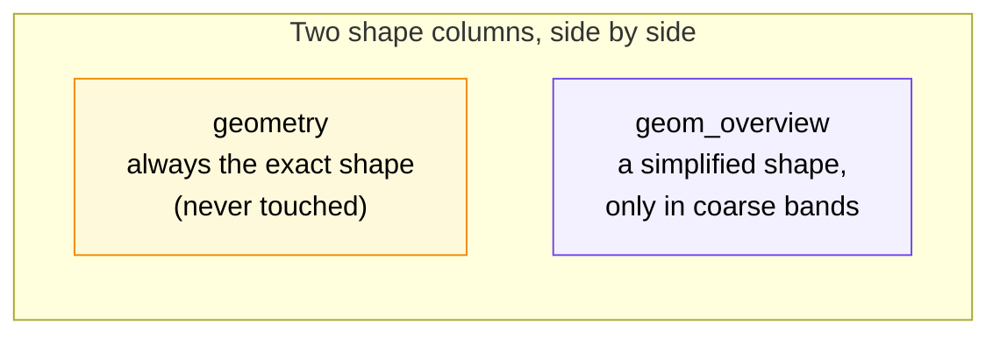
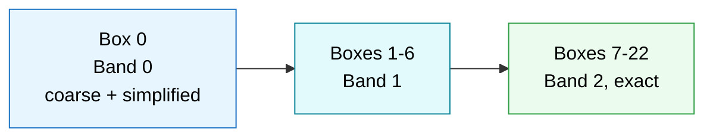
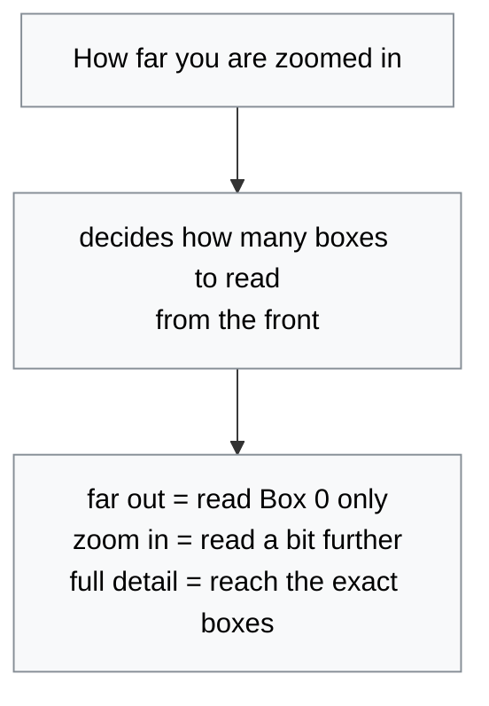
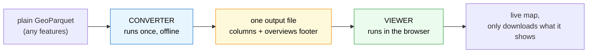
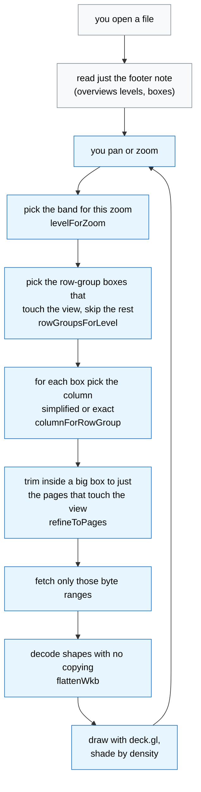
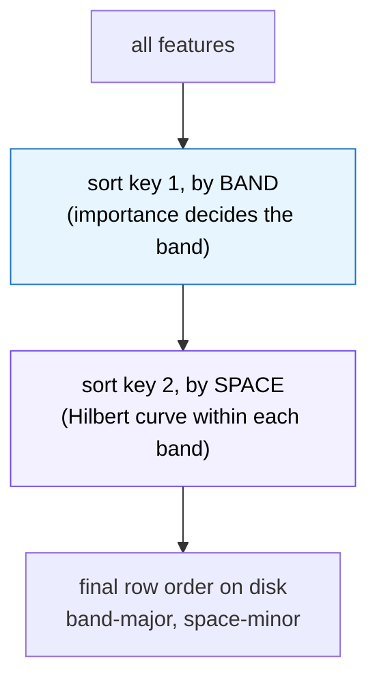
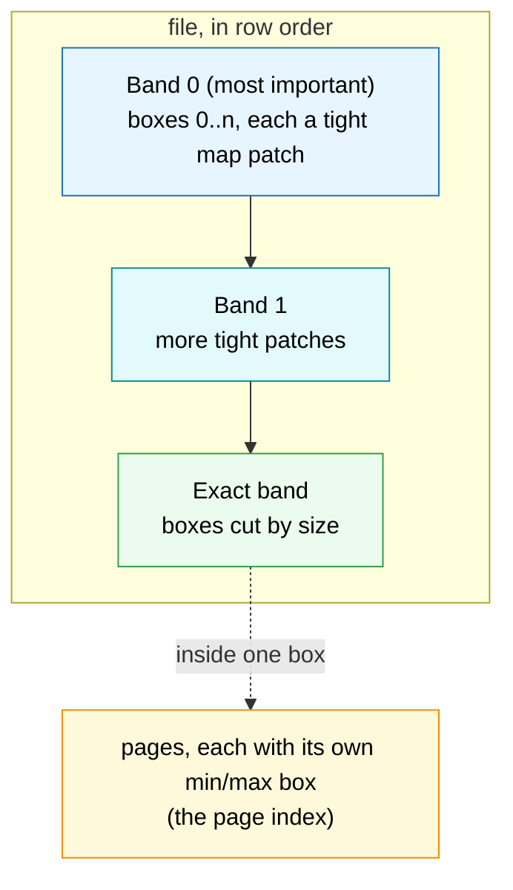

# How we avoid duplicating the simplified geometry

A plain, mostly non-technical walkthrough of the whole idea. It builds up in layers, so
you can stop after the intuition or read on for the exact mechanics.

1. **The intuition.** Why the simplified shape in `geom_overview` is not copied once per
   zoom level, and how row groups let the viewer read only what it needs. (Start here.)
2. **Who does what.** What the converter prepares into the file, then what the viewer does
   step by step to read and draw it.
3. **The sorting.** How importance and space together fit features into row groups, boxes,
   and pages so the viewer can skip almost everything.

---

## The everyday way maps usually work (and why it wastes space)

Think about how most web maps zoom. To show the map far out, at the region, and at
the street, they usually build a **separate picture for every zoom level**. The same
road gets drawn again in the country view, again in the region view, again in the
city view, and again in the street view.

So one road ends up stored **many times**, once per zoom.

That is a lot of duplicated copies. It is fast to view, but the file gets big and the
detail is baked in, so a database engine cannot read the true, exact shape back out.

---

## The way this project works (each feature written down once)

Here every feature (each building, road, or point) is written **one time only**.
There are no per-zoom copies.

We do it in three simple moves.

**1. Rank by importance.** Put the biggest and most important features first, the
small ones last.

**2. Split into a few bands.** A band is just a slice of that ranked list. Band 0
holds a thin, spread-out set of the most important features, enough to fill the screen
when you are zoomed all the way out. The next band adds more. The final band holds
everyone left over and is kept **exact**.

**3. Every feature belongs to exactly one band.** It is never repeated in another band.

### Where does the simplified shape live

Only the **coarse** bands (band 0, band 1) carry a lightweight, simplified copy of
their features. That simplified copy sits in a spare column called `geom_overview`.

The key point. That simplified shape exists **at most once per feature**, sitting next
to it in its own band. It is not repeated across zoom levels. The finest band leaves
`geom_overview` empty because it already has the exact shape.

So there is no duplication because **zoom is not served by copies**. Zooming in does
not fetch a different picture of the same feature. It reads **more of the bands**, up to
the one that matches the zoom, so more features and finer detail come into view.

---

## How row groups make this cheap to read

A Parquet file is stored in chunks called **row groups**. Think of them as numbered
boxes inside the file, in order, box 0 first.

We lay the bands out **in order at the front of the file**. Band 0 goes in the first
box, band 1 in the next boxes, the exact band in the boxes after that.

Because the boxes are in order, the viewer reads only the **front slice** it needs and
stops.

| What you are looking at | Boxes the viewer reads | The rest of the file |
| --- | --- | --- |
| Whole country, zoomed out | just Box 0 (Band 0) | never downloaded |
| A region | Box 0 plus a few more | never downloaded |
| A single street | reads into the exact boxes for that area | only the overlapping part |

A little note in the file (the `overviews` footer) records where each band ends, so the
viewer knows exactly which box is the last one it must read for a given zoom. That is
the `row_group_end` value.

---

## The whole idea in one line

Store every feature **once**, keep a single simplified copy only in the coarse bands,
lay the bands in order, and serve zoom by reading **more of the front of the file**,
never by keeping duplicate copies per zoom.

---

# Who does what, the converter and the viewer

There are two programs. The **converter** runs once, offline, and bakes a normal
parquet file into the special layout above. The **viewer** runs in your browser and
reads that file over the network, a little at a time. They never talk to each other
directly. The only thing they share is the file and a small note inside it (the
`overviews` footer). The converter writes that note, the viewer reads it.

---

## Part A. What the converter prepares

The converter reads the whole dataset once and does these moves in order. Each move
has a real function name in `converter/src/geoparquet_overviews/convert.py` if you
ever want to find it.

1. **Read the file** into memory and find the geometry column.
2. **Understand the map units** (degrees or metres) and the CRS, so all the later math
   is in the right units.
3. **Decode every shape** and measure it (its box, area or length, and whether it is
   valid). `_decode_wkb`
4. **Pick the far-out starting zoom** for this dataset, the zoom where the whole
   dataset just fills a screen. A city file starts further in than a country file.
   `_coarsest_zoom`
5. **Decide how many bands to make**, based on how dense the data is and a screen
   budget so a first paint stays light. `_derive_bands`
6. **Rank the features** by importance (area for polygons, length for lines, an
   attribute or a grid for points). `_assign_bands`
7. **Thin into bands.** Starting from the coarsest band, keep one winner per screen
   pixel and push everyone else down into the next finer band. Nobody is dropped, the
   last band is exact and keeps everyone left. `_thin_bands`
8. **Sort the rows band by band**, and inside each band along a Hilbert curve so
   nearby features sit next to each other on disk. `_hilbert_distance`
9. **Build the simplified shapes** for the coarse bands (simplify, snap to that band's
   grid, and if a shape collapses to nothing draw a tiny placeholder box or line so it
   never vanishes). `_build_overview`, `_quad_fallback`, `_segment_fallback`
10. **Lay out the row groups** band by band so the coarse bands sit in the first boxes.
    `_plan_row_groups`
11. **Write the columns and stamp the footer note** with where every band ends.
    `_write`

### What actually lands in the output file

**Columns** (one row per feature, each feature once)

| Column | What it holds |
| --- | --- |
| `geometry` | the exact original shape, never changed |
| `geom_overview` | the simplified shape, only for coarse bands, empty on the exact band |
| `band` | which band the feature is in (0 is coarsest, last is exact) |
| `bbox` | a small box around each feature, used to skip features outside the view |
| `overview_count` | for a coarse survivor, how many features it stands in for (the density signal) |
| your attributes | every other column from the source, carried through untouched |

**The `overviews` footer note** (written by `footer.overviews_meta`). At the top it
records the `version` (`0.3.0`), the `regime` label, which column is the overview
(`overview_column`), how shapes were simplified (`overview_method`), and the density
column name (`count_column`). Then a list called `levels`, one entry per band, each
carrying:

| Field | Meaning |
| --- | --- |
| `level` | the band number |
| `row_group_end` | the last box (row group) that belongs to this band |
| `min_zoom` / `max_zoom` | the zoom range this band is meant to paint |
| `gsd` | how coarse the simplified shape is, in map units per pixel |
| `grid` | the snap grid this band used |
| `feature_count` | how many features are in the band |
| `extent` | the box around the whole band |
| `bytes` | the exact byte range in the file where this band lives |

That `row_group_end` and `bytes` pair is the whole handshake. It is how the viewer
knows, without reading the data, exactly which slice of the file to fetch for a zoom.

---

## Part B. What the viewer does, step by step

The viewer never downloads the whole file. It reads the tiny footer note first, then
fetches only the byte ranges it needs for what is on screen. Every time you pan or
zoom, it repeats the read step.

**Step 1. Read the footer note.** On open, `loadMetadataFromUrl` fetches only the end
of the file and parses the `overviews` levels, the per-box boxes, and the CRS. Small
files (under 32 MB) are just downloaded whole once. Nothing is drawn yet.

**Step 2. Pick the band for the current zoom.** On every settled pan or zoom,
`levelForZoom` looks at the zoom and picks the coarsest band whose `max_zoom` still
covers it. Far out picks band 0, close in picks the exact band.

**Step 3. Pick the boxes to read.** `rowGroupsForLevel` takes the prefix of boxes up to
that band's `row_group_end`, then drops any box whose stored box does not touch what is
on screen. Whole bands that sit off screen are skipped outright. Everything else in the
file is never requested.

**Step 4. Pick the column per box.** `columnForRowGroup` decides, box by box, whether to
read the light `geom_overview` or the exact `geometry`. Coarse bands read the overview.
There is one careful rule for 0.3.0 files. If a coarse band gets pulled in as part of a
finer band's prefix, the viewer reads that coarse band's **exact** geometry instead of
its overview, because each band's overview is snapped to its own grid and would look
like a giant block at the wrong zoom. This is the giant-triangle fix.

**Step 5. Trim inside a big box.** If a single box covers far more area than the view,
`refineToPages` reads the box's page index and fetches only the pages that overlap the
view, not the whole box. If anything about that is unclear or unavailable, it safely
falls back to reading the whole box.

**Step 6. Fetch and decode.** `readColumnProgressive` fetches the chosen byte ranges and
`flattenWkb` reads the shapes straight into flat number arrays with no intermediate
copies, reprojecting to lon and lat as it goes.

**Step 7. Draw and shade.** `buildLayers` hands the flat arrays to deck.gl as polygon,
line, and point layers over the MapLibre basemap. The `overview_count` column feeds
`density-style.ts` so busier cells paint bigger and stronger, which puts back the
density that thinning would otherwise hide.

**Step 8. Click a feature.** A click resolves the exact parquet row behind that shape and
`readRowAttributes` fetches only that one row's attribute columns on demand, then shows
them in a popup. The geometry read path is never touched.

---

# How the sorting fits features into row groups, boxes, and pages

This is the part that makes the pruning actually work. Two different orderings are at
play, and they answer two different questions.

- **Importance** answers **which band** a feature goes in, so which slice of the file.
- **Space** answers **what order** features sit in **inside** a band, so the boxes around
  each chunk stay small and tight.

Both are baked in by one sort. In code it is `np.lexsort((hilbert, band))`, read as
**band first, space second**.

## Step 1. Importance sets the band, so the file slice

Ranking by importance (area for polygons, length for lines, an attribute or a grid for
points) and then thinning is what puts a feature in a band. Because the rows are sorted
band first, **all of band 0 sits together at the front of the file, then all of band 1,
then the exact band**. Importance is therefore what decides which contiguous slice of
the file a feature lives in. Nothing more, it does not set the fine order.

## Step 2. Space (the Hilbert curve) sets the order inside a band

Inside one band, features are ordered along a **Hilbert curve**, a path that visits the
map so that things close together on the map end up close together in the row order. So
neighbours on the map become neighbours on disk.

Why this matters. It means any run of rows in a band covers a small, compact patch of the
map, not a scatter of dots spread across the whole country.

## Step 3. Fitting rows into row groups (the boxes)

A row group is a box of rows written together. `_plan_row_groups` fills them like this.

- Cuts **always land on a band boundary**, so a coarse band never shares a box with the
  exact band.
- Each **coarse band** is split into up to 32 near-equal chunks (`--coarse-row-groups`,
  at least 1024 rows each). Because the band is Hilbert-ordered, each chunk is a tight
  little patch of the map.
- The **exact band** is instead cut by size, it starts a new box once the geometry bytes
  pass the budget, so no single box is too heavy to fetch.

## Step 4. The bbox covering column and its padding

Every feature also gets a tiny `bbox`, a box around just that feature. Parquet then keeps
a box around **all the features in each row group** for free. Because a Hilbert chunk is a
tight patch, that per-group box is small. That is the whole trick. The viewer looks at a
group's box, and if it does not touch what is on screen it skips the entire group without
reading it.

Coarse-band boxes are padded outward by half the snap grid, because snapping the
simplified shape can nudge a vertex just outside the raw box, and a viewer must never skip
a feature its overview still paints.

## Step 5. The page index, pruning below a row group

Inside one row group the data is written in smaller **pages**. Parquet's page index keeps
a min and max box **per page** (the ColumnIndex) plus where each page starts (the
OffsetIndex). So when one row group is much bigger than the view, the viewer reads that
page index and fetches **only the pages whose box touches the screen**, not the whole
group. The `--page-size-kb` flag sets how fine those pages are. If anything is missing or
unclear, the viewer safely reads the whole group instead.

So the chain is, **importance picks the band and thus the file slice, the Hilbert curve
makes each chunk a tight patch, tight patches make the row-group and page boxes small, and
small boxes let the viewer skip almost everything it cannot see.**

---

## The one-line contract between them

The converter writes each feature **once**, in band order, and leaves a footer note
saying where each band ends. The viewer reads that note first, then fetches only the
front slice of boxes, only the columns, and only the pages that the current view needs.

